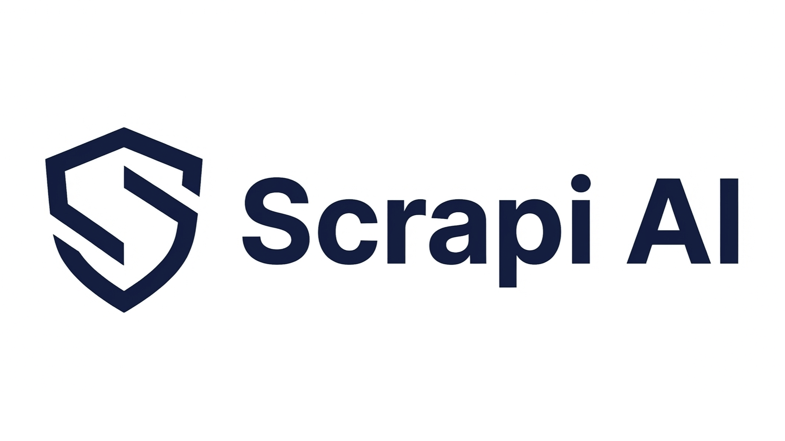

<p align="center">
  <picture>
    <source media="(prefers-color-scheme: dark)" srcset="assets/logo-dark-horizontal-trans.png">
    <source media="(prefers-color-scheme: light)" srcset="assets/logo-white-horizontal-trans.png">
    
  </picture>
</p>

<h3 align="center">MCP server that converts URLs to clean Markdown/Text for LLM agents</h3>

<p align="center">
  <a href="README-KO.md">한국어</a> ·
  <a href="https://scrapi.ai">Website</a> ·
  <a href="https://scrapi.ai/dashboard">Dashboard</a>
</p>

<p align="center">
  <a href="https://www.npmjs.com/package/@scrapi.ai/mcp-server"></a>
  <a href="https://opensource.org/licenses/MIT"></a>
</p>

**⚡ Fast & Reliable** — Built on 8+ years of web scraping expertise, 1,900+ production crawlers, and battle-tested anti-bot handling.

## What is this?

An [MCP (Model Context Protocol)](https://modelcontextprotocol.io/) server that lets AI agents fetch and read web pages. Simply give it a URL, and it returns clean, LLM-ready content — fast.

**Before:** AI can't read web pages directly  
**After:** "Summarize this article" just works ✨

---

## Features

- 🌐 **URL → Markdown**: Preserves headings, lists, links
- 📄 **URL → Text**: Plain text extraction
- 🏷️ **Metadata**: Title, author, date, images
- 🧹 **Clean Output**: No ads, no navigation, no scripts
- ⚡ **JavaScript Rendering**: Works with SPAs
- 💳 **Built-in Billing**: Credit tracking, subscription management, usage analytics (MCP keys)
- 🔄 **Auto-Retry**: 429 rate limit responses automatically retried with Retry-After
- 🌍 **Dual Transport**: Stdio (npx) + Streamable HTTP for flexible deployment

---

## Transport Modes

Scrapi MCP Server supports two transport modes:

| Mode | Best For | Node.js Required |
|------|----------|-----------------|
| **Stdio** | Claude Desktop, Cursor, Cline, Claude Code | Yes (auto via npx) |
| **Streamable HTTP** | All clients, Node.js-free environments | No |

---

## Prerequisites

- [Scrapi MCP](https://scrapi.ai) account (separate from the main Scrapi account)
- Claude Desktop, Cline, or Cursor installed
- Node.js 20+

---

## Installation

### Option A: npx (Recommended)

No installation needed. Just configure your MCP client to use `npx`.

```json
{
  "mcpServers": {
    "scrapi": {
      "command": "npx",
      "args": ["-y", "@scrapi.ai/mcp-server"],
      "env": {
        "SCRAPI_API_KEY": "your-api-key"
      }
    }
  }
}
```

> See [Step 2](#step-2-configure-mcp-server) for where to put this configuration.

### Option B: Install from Source

```bash
# Clone the repository
git clone https://github.com/bamchi/scrapi-mcp-server.git
cd scrapi-mcp-server

# Install dependencies and build
npm install && npm run build
```

---

## Step 1: Get Your API Key

1. Go to [https://scrapi.ai](https://scrapi.ai)
2. Sign up or log in
3. Visit the [MCP Dashboard](https://scrapi.ai/dashboard) — your Free plan (500 credits/month) and API key are created automatically
4. Copy your `hsmcp_` API key

---

## Step 2: Configure MCP Server

### Claude Desktop

**Option A: Via Settings (Recommended)**

1. Open Claude Desktop
2. Click Settings (gear icon, bottom left)
3. Select Developer tab
4. Click "Edit Config" button
5. Add the mcpServers configuration (see below)
6. Save and restart Claude Desktop (Cmd+Q, then reopen)

**Option B: Edit config file directly**

- macOS: `~/Library/Application Support/Claude/claude_desktop_config.json`
- Windows: `%APPDATA%\Claude\claude_desktop_config.json`

**Configuration (npx):**

```json
{
  "mcpServers": {
    "scrapi": {
      "command": "npx",
      "args": ["-y", "@scrapi.ai/mcp-server"],
      "env": {
        "SCRAPI_API_KEY": "your-api-key"
      }
    }
  }
}
```

**Configuration (from source):**

```json
{
  "mcpServers": {
    "scrapi": {
      "command": "node",
      "args": ["/absolute/path/to/scrapi-mcp-server/dist/index.js"],
      "env": {
        "SCRAPI_API_KEY": "your-api-key"
      }
    }
  }
}
```

> Note: Replace `/absolute/path/to/` with the actual path where you cloned the repository.

### Cline

Config file location:
- macOS: `~/Library/Application Support/Code/User/globalStorage/saoudrizwan.claude-dev/settings/cline_mcp_settings.json`
- Windows: `%APPDATA%\Code\User\globalStorage\saoudrizwan.claude-dev\settings\cline_mcp_settings.json`

**Configuration (npx):**

```json
{
  "mcpServers": {
    "scrapi": {
      "command": "npx",
      "args": ["-y", "@scrapi.ai/mcp-server"],
      "env": {
        "SCRAPI_API_KEY": "your-api-key"
      }
    }
  }
}
```

**Configuration (from source):**

```json
{
  "mcpServers": {
    "scrapi": {
      "command": "node",
      "args": ["/absolute/path/to/scrapi-mcp-server/dist/index.js"],
      "env": {
        "SCRAPI_API_KEY": "your-api-key"
      }
    }
  }
}
```

### Cursor

Create or edit `.cursor/mcp.json` in your project root:

**Configuration (npx):**

```json
{
  "mcpServers": {
    "scrapi": {
      "command": "npx",
      "args": ["-y", "@scrapi.ai/mcp-server"],
      "env": {
        "SCRAPI_API_KEY": "your-api-key"
      }
    }
  }
}
```

**Configuration (from source):**

```json
{
  "mcpServers": {
    "scrapi": {
      "command": "node",
      "args": ["/absolute/path/to/scrapi-mcp-server/dist/index.js"],
      "env": {
        "SCRAPI_API_KEY": "your-api-key"
      }
    }
  }
}
```

### Claude Code

Edit `~/.claude.json` or project `.mcp.json`:

**Configuration (npx):**

```json
{
  "mcpServers": {
    "scrapi": {
      "command": "npx",
      "args": ["-y", "@scrapi.ai/mcp-server"],
      "env": {
        "SCRAPI_API_KEY": "your-api-key"
      }
    }
  }
}
```

### Streamable HTTP

Connect via Streamable HTTP — no Node.js installation needed on the client side.

Two endpoints are available (both work identically):
- `https://scrapi.ai/api` — default
- `https://scrapi.ai/mcp` — standard MCP path

**Cursor** (`.cursor/mcp.json`):

```json
{
  "mcpServers": {
    "scrapi": {
      "url": "https://scrapi.ai/mcp",
      "headers": {
        "Authorization": "Bearer your-api-key"
      }
    }
  }
}
```

**Claude Code** (CLI):

```bash
claude mcp add --transport http scrapi https://scrapi.ai/mcp \
  --header "Authorization: Bearer your-api-key"
```

**Cline** (`cline_mcp_settings.json`):

```json
{
  "mcpServers": {
    "scrapi": {
      "type": "streamableHttp",
      "url": "https://scrapi.ai/mcp",
      "headers": {
        "Authorization": "Bearer your-api-key"
      }
    }
  }
}
```

**Claude Desktop** (`claude_desktop_config.json`):

```json
{
  "mcpServers": {
    "scrapi": {
      "command": "npx",
      "args": [
        "mcp-remote",
        "https://scrapi.ai/mcp",
        "--header",
        "Authorization: Bearer your-api-key"
      ]
    }
  }
}
```

> Note: Claude Desktop requires the [mcp-remote](https://www.npmjs.com/package/mcp-remote) proxy for HTTP connections.

<details>
<summary>Self-host the HTTP server (advanced)</summary>

Run your own instance instead of using the hosted endpoint:

```bash
SCRAPI_API_KEY=your-api-key npx -y -p @scrapi.ai/mcp-server scrapi-http
# or from source:
SCRAPI_API_KEY=your-api-key node dist/http.js
```

The server starts at `http://localhost:3000` with endpoints at `/api` and `/mcp`. Configure with `PORT` and `HOST` environment variables. Replace the URL in the client configurations above with your self-hosted URL.

**Health check:** `GET http://localhost:3000/health`

</details>

---

## Step 3: Restart Your AI Client

- **Claude Desktop**: Fully quit (Cmd+Q on macOS, Alt+F4 on Windows) and reopen
- **Claude Code**: Restart the session
- **Cline**: Restart VS Code
- **Cursor**: Restart the editor

You should see the MCP server connection indicator.

---

## Available Tools

### `scrape_url`

Scrapes a webpage and returns AI-readable content.

**Parameters:**

| Name     | Type   | Required | Description                              |
| -------- | ------ | -------- | ---------------------------------------- |
| `url`    | string | ✅        | URL to scrape                            |
| `format` | string |          | `markdown` (default) or `text`           |

**Example:**

```json
{
  "url": "https://example.com/article",
  "format": "markdown"
}
```

**Markdown Output:**

```markdown
# Article Title

> Author: John Doe | Published: 2024-01-15

## Introduction

This is the main content of the article, converted to clean markdown...

## Key Points

- Point 1: Important detail
- Point 2: Another insight
- [Related Link](https://example.com/related)
```

**Text Output:**

```text
Article Title

Author: John Doe | Published: 2024-01-15

Introduction

This is the main content of the article, converted to plain text...

Key Points

- Point 1: Important detail
- Point 2: Another insight
```

### `scrape_urls`

Scrapes multiple webpages in parallel and returns AI-readable content.

**Parameters:**

| Name     | Type     | Required | Description                              |
| -------- | -------- | -------- | ---------------------------------------- |
| `urls`   | string[] | ✅        | URLs to scrape (max 10)                  |
| `format` | string   |          | `markdown` (default) or `text`           |

**Example:**

```json
{
  "urls": ["https://example.com/page1", "https://example.com/page2"],
  "format": "text"
}
```

**Output:**

```json
[
  {
    "url": "https://example.com/page1",
    "content": "Page 1 Title\n\nThis is the content of page 1..."
  },
  {
    "url": "https://example.com/page2",
    "content": "Page 2 Title\n\nThis is the content of page 2..."
  }
]
```

### `scraper_server_status`

Check the status of all ScraperServer instances. Shows server health, circuit breaker state, failure counts, and timing info.

**Parameters:** None

**Example:**

```json
{}
```

**Output:**

```markdown
## ScraperServer Status

Total: 3 | Available: 2

| Name | OS | Status | Failures | Last Success | Last Failure |
|------|----|--------|----------|--------------|--------------|
| pluto | linux | OK | 0 | 01/30 14:23:05 | - |
| mars | mac | FAIL | 2 | 01/29 10:00:00 | 01/30 13:55:12 |
| venus | linux | OPEN | 3 | 01/28 09:00:00 | 01/30 12:00:00 |

### Issues
- **mars**: Connection refused - connect(2)
- **venus**: Circuit breaker open until 01/30 12:30:00
- **venus**: Net::ReadTimeout
```

**Status values:**

| Status | Description |
|--------|-------------|
| `OK` | Server is healthy |
| `FAIL` | Server is unhealthy |
| `OPEN` | Circuit breaker open (isolated for 30 min) |
| `N/A` | Not yet checked |

### `get_usage`

Check your API usage and remaining credits.

**Parameters:** None

**Example:**

```json
{}
```

**Output:**

```markdown
## MCP Credits

| Item | Value |
|------|-------|
| Plan | starter |
| Subscription Credits | 1,500 |
| Purchased Credits | 200 |
| Total Remaining | 1,700 |
| Period End | 2026-03-01 |
```

### `get_billing`

Retrieve detailed billing information including subscription, plans, daily usage, and spending limits.

**Parameters:**

| Name | Type | Required | Description |
|------|------|----------|-------------|
| `action` | string | Yes | `subscription`, `plans`, `daily_usage`, or `spending_limits` |
| `start_date` | string | | Start date for `daily_usage` (YYYY-MM-DD, default: 30 days ago) |
| `end_date` | string | | End date for `daily_usage` (YYYY-MM-DD, default: today) |

**Example — Current subscription:**

```json
{ "action": "subscription" }
```

```markdown
## MCP Subscription

| Item | Value |
|------|-------|
| Plan | starter (Starter) |
| Status | active |
| Monthly Credits | 2,000 |
| Price | $19.00/mo |
| Rate Limit | 30 RPM |
| Burst Limit | 5 concurrent |
| Period End | 2026-03-01 |
```

**Example — Available plans:**

```json
{ "action": "plans" }
```

```markdown
## Available MCP Plans

| Plan | Credits/mo | Price | RPM | Burst |
|------|-----------|-------|-----|-------|
| Free (free) | 500 | Free | 10 | 2 |
| Starter (starter) | 2,000 | $19.00/mo | 30 | 5 |
| Pro (pro) | 10,000 | $49.00/mo | 60 | 10 |
| Business (business) | 50,000 | $149.00/mo | 120 | 20 |
```

**Example — Daily usage history:**

```json
{ "action": "daily_usage", "start_date": "2026-02-01", "end_date": "2026-02-07" }
```

```markdown
## Daily Usage (2026-02-01 ~ 2026-02-07)

| Date | Requests | Credits | Top Tool |
|------|----------|---------|----------|
| 2026-02-07 | 45 | 45 | scrape#scrape (45) |
| 2026-02-06 | 120 | 120 | scrape#scrape (100) |

**Total**: 165 requests, 165 credits
```

**Example — Spending limits:**

```json
{ "action": "spending_limits" }
```

```markdown
## Spending Limits

| Item | Value |
|------|-------|
| Daily Limit | 500 credits |
| Today's Usage | 120 credits |
| Usage % | 24.0% |
```

---

## Usage Examples

### Example 1: Summarize a News Article

```
User: Summarize this article: https://news.example.com/article/12345

Claude: [calls scrape_url]

Here's a summary of the article:

## Key Points
- Point 1: ...
- Point 2: ...
- Point 3: ...
```

### Example 2: Fetch Page Content

```
User: Get the content from https://example.com/data

Claude: [calls scrape_url]

# Page Title
> Source: https://example.com/data

The page content is returned in clean Markdown format...
```

### Example 3: Research Competitor Pricing

```
User: What's the pricing on https://competitor.com/product/abc

Claude: [calls scrape_url]

Here's the pricing information:
- **Product**: ABC Premium
- **Regular Price**: $99.00
- **Sale Price**: $79.00 (20% off)
```

### Example 4: Read API Documentation

```
User: Read https://docs.example.com/api/v2 and write integration code

Claude: [calls scrape_url]

I've analyzed the API documentation. Here's the integration code:

// api-client.ts
export class ExampleApiClient {
  private baseUrl = 'https://api.example.com/v2';
  
  async getData(): Promise<Response> {
    // ...
  }
}
```

---

## How It Works

```
┌─────────────────┐
│     User        │
│ "Summarize this │
│   URL for me"   │
└────────┬────────┘
         │
         ▼
┌─────────────────┐
│  Claude Desktop │
│    / Cursor     │
└────────┬────────┘
         │
         ▼
┌─────────────────┐     ┌─────────────────┐
│   MCP Server    │────►│   Scrapi API    │
│  (scrape_url)   │     │ (format param)  │
└────────┬────────┘     └────────┬────────┘
         │                       │
         │◄──────────────────────┘
         │   Markdown/Text Response
         ▼
┌─────────────────┐
│   AI Response   │
│ (Summary, etc.) │
└─────────────────┘
```

---

## Why Scrapi?

Built by the team behind [Scrapi](https://scrapi.ai), with 8+ years of web scraping experience:

- ✅ 1,900+ production crawlers
- ✅ JavaScript rendering support
- ✅ Anti-bot handling
- ✅ 99.9% uptime

---

## Troubleshooting

### "API key is required"

Make sure your `SCRAPI_API_KEY` environment variable is set correctly in the configuration file.

### "Invalid API key"

Verify that your API key is correct and active in your Scrapi dashboard.

### MCP Server not connecting

1. Ensure Node.js 20+ is installed
2. Try running `node /absolute/path/to/scrapi-mcp-server/dist/index.js` manually to check for errors
3. Fully quit Claude Desktop (Cmd+Q on macOS, Alt+F4 on Windows) and restart
4. Check Settings > Developer to verify the server is listed

### Developer tab not visible

Update Claude Desktop to the latest version: Claude menu → "Check for Updates..."

---

## Support

- Email: help@hashscraper.com
- Issues: [GitHub Issues](https://github.com/bamchi/scrapi-mcp-server/issues)

---

## License

MIT © [Scrapi](https://scrapi.ai)
